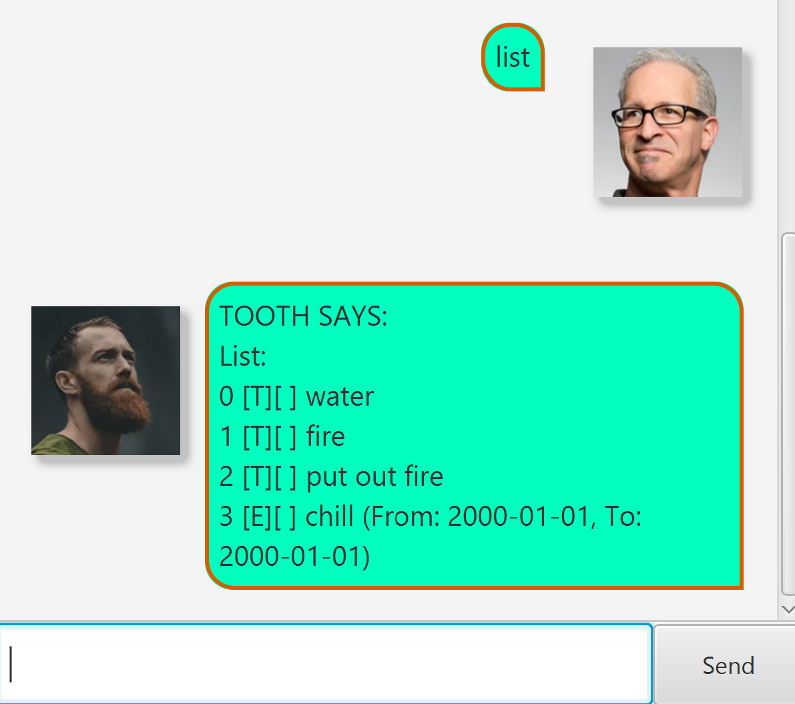
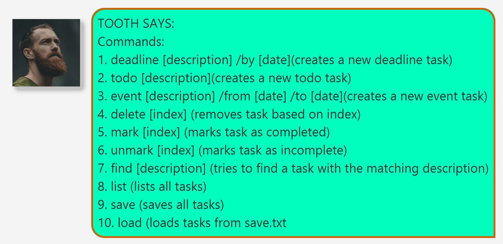
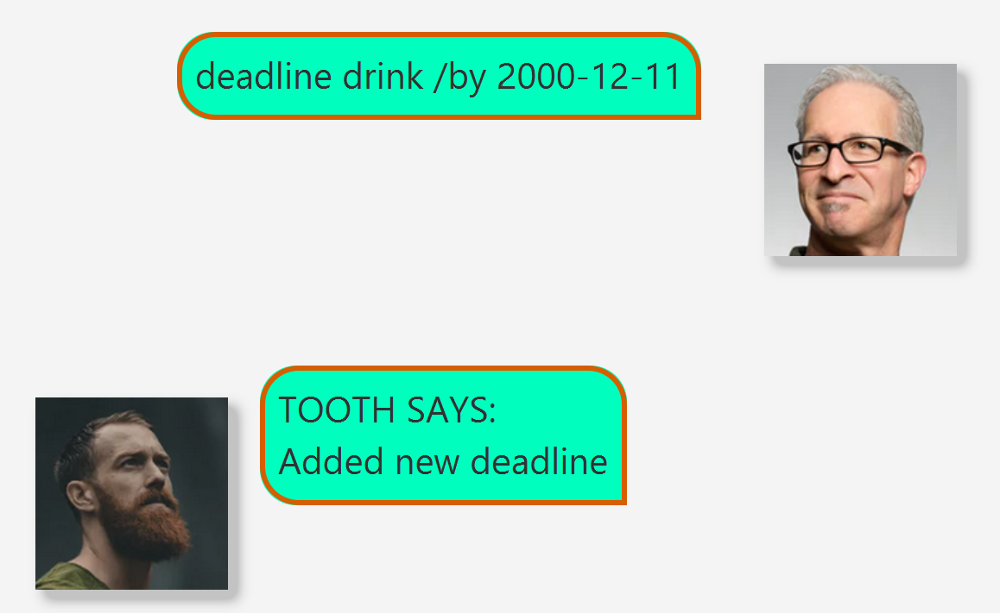
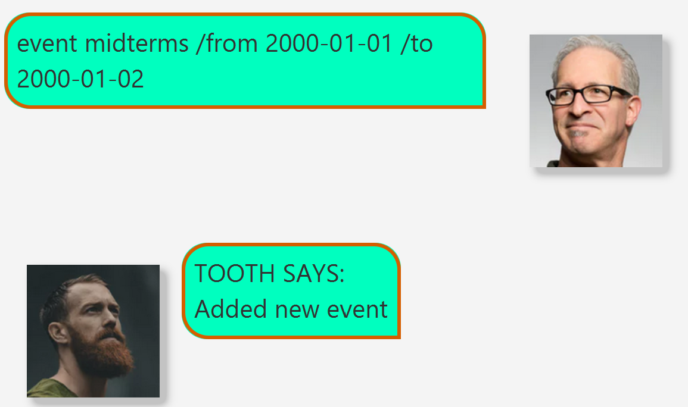
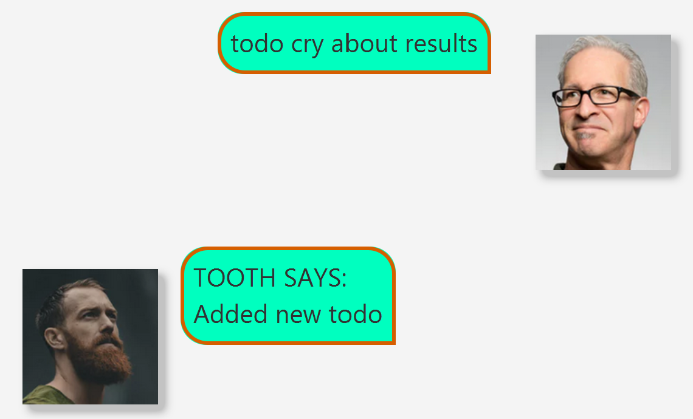
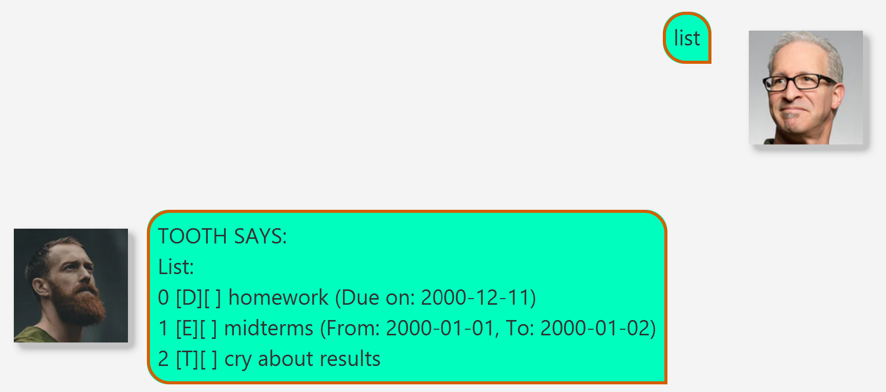
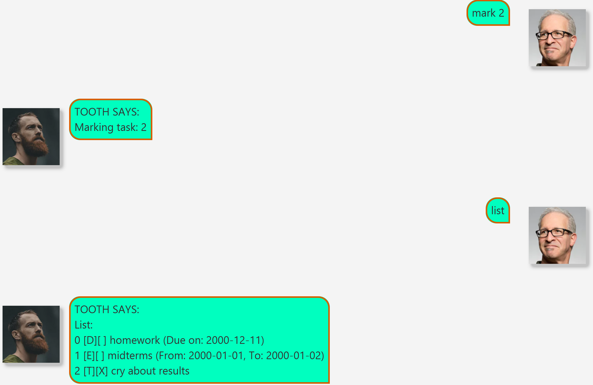
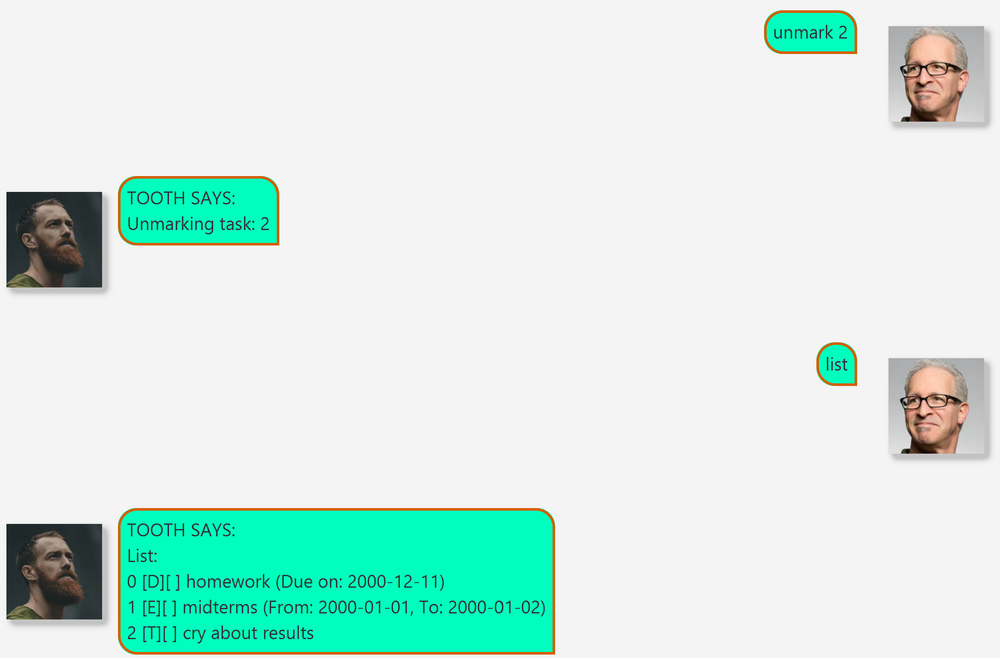
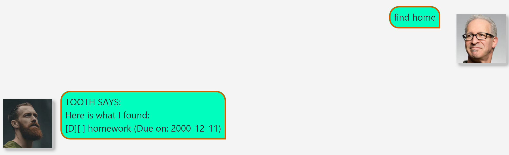

# Tooth User Guide

## About
Tooth is a task-managing chatbot optimised for CLI-commands fitted with some GUI elements

### Tooth Features:
<ol>
    <li>Adding Tasks (Deadline, Todo and Events)</li>
    <li>Deleting Tasks</li>
    <li>Reading Tasks</li>
    <li>Marking Tasks as complete or incomplete</li>
    <li>Finding Tasks based on description</li>
    <li>Saving and loading</li>
</ol>

## Help Command
To look at list of commands, run the `help` command. Tooth will then list out all possible commands supported by tooth

## Adding deadlines

Deadlines are tasks with a fix end-date

To create a deadline type: `deadline [description] /by [date]`

Example: `deadline homework /by 2000-01-01`

Take note of the format for date `YYYY-MMM-DD`

## Adding events

Event are tasks with a fix end-date and a fixed start date

To create an event type: `event [description] /from [date] /to [date]`

Example: `event midterms /from 2000-01-01 /to 2000-01-02`

Take note of the format for date `YYYY-MMM-DD`

## Adding todos

Todo are tasks with neither end-date nor start date

To create an event type: `todo [description]`

Example: `todo cry about results`

## Listing all tasks

To view all task and their respective index use the list command

Simply type `list`

# Mark task as complete

To mark a class as complete, you can use the mark command

Run: `mark [index]`

Example: `mark 2`

# Unmark task as Incomplete

To unmark a class as incomplete, you can use the unmark command

Run: `unmark [index]`

Example: `unmark 2`

# Finding tasks

The find command acts as a filter for tasks based on their description

Run: `find [description snippet]`

Example: `find home`

# Saving and Loading Files

Finally, use `save` to save the tasks in save.txt and `load` to load from save.txt 